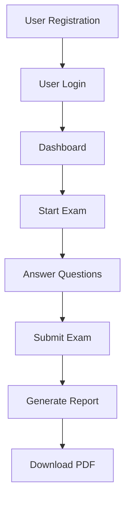

<div align="center">

# 🚀 QuestPro  
### Modern Browser-Based Exam & Assessment Platform

<p align="center">
  
  
  
  
</p>

<p align="center">
  A powerful browser-based examination system built using <b>React + Vite</b> with
  timed assessments, attempt tracking, PDF reports, analytics dashboards, and a modern UI experience.
</p>

</div>

---

# ✨ Overview

**QuestPro** is a complete assessment workflow platform designed for technical exams, mock tests, internal evaluations, and learning assessments.

The platform delivers:

- 🧠 Smart exam workflow
- ⏱ Timed assessments
- 📊 Interactive analytics
- 📄 PDF report generation
- 🔐 Authentication system
- 📱 Fully responsive experience

Built with performance-focused architecture using **React**, **Vite**, and reusable component design.

---

# 🌟 Features

## 🔐 Authentication

- User registration
- Login system
- Browser-based session management
- Persistent user state using localStorage

---

## 📝 Exam Engine

- Dynamic questions loaded from local JSON
- Supports **150-question assessments**
- Question navigation system
- Flag questions for later review
- Manual submission support
- Auto-submit after **60 minutes**

---

## 🎯 Attempt Intelligence

- Maximum **3 attempts**
- Passing score: **80%**
- Tracks successful attempt number
- Stores full attempt history

---

## 📊 Reports & Analytics

After exam completion, users get:

- ✅ Total score
- 📈 Percentage analytics
- ❌ Pass / Fail status
- 🧾 Answer review
- 📉 Answered vs unanswered metrics
- 📄 Downloadable PDF report

---

## 🎨 Modern UI / UX

- Glassmorphism-inspired design
- Clean dashboard interface
- Mobile responsive layout
- Smooth transitions & interactions
- Reusable React component architecture

---

# 🛠 Tech Stack

| Layer | Technology |
|------|------------|
| Frontend | React |
| Build Tool | Vite |
| Routing | React Router DOM |
| State Management | Context API |
| Data Source | Local JSON |
| Persistence | localStorage |
| PDF Reports | jsPDF |
| Styling | Custom CSS |

---

# 📂 Project Structure

```bash
quest-app/
├── public/
├── src/
│   ├── components/
│   │   ├── report/
│   │   └── Layout.jsx
│   ├── data/
│   │   └── questions.json
│   ├── state/
│   │   └── AppContext.jsx
│   ├── utils/
│   │   └── reportHelpers.js
│   ├── views/
│   │   ├── DashboardPage.jsx
│   │   ├── ExamPage.jsx
│   │   ├── LoginPage.jsx
│   │   ├── RegisterPage.jsx
│   │   └── ReportPage.jsx
│   ├── App.jsx
│   ├── main.jsx
│   └── styles.css
├── index.html
├── package.json
└── vite.config.js
```

---

# 🔄 Application Flow



---

# 📋 Exam Rules

| Rule | Value |
|------|-------|
| Total Questions | 150 |
| Time Limit | 60 Minutes |
| Maximum Attempts | 3 |
| Passing Score | 80% |
| Submission Mode | Manual / Auto |
| Review Mode | Attempted Questions Only |

---

# ⚡ Local Setup

## 1️⃣ Clone Repository

```bash
git clone https://github.com/your-username/quest-app.git
```

---

## 2️⃣ Navigate to Project

```bash
cd quest-app
```

---

## 3️⃣ Install Dependencies

```bash
npm install
```

---

## 4️⃣ Start Development Server

```bash
npm run dev
```

---

## 5️⃣ Build for Production

```bash
npm run build
```

---

## 6️⃣ Preview Production Build

```bash
npm run preview
```

---

# 🚀 Deployment

This project can be deployed easily on:

- ▲ Vercel
- Netlify
- GitHub Pages

### Recommended: Vercel

```bash
npm run build
```

Then import the repository into Vercel.

---

# 📄 PDF Reporting System

QuestPro includes a professionally designed PDF report system powered by **jsPDF**.

The report includes:

- Candidate information
- Score breakdown
- Performance charts
- Attempt analytics
- Answer review
- Pass/fail summary

---

# 🔒 Current Limitations

This project currently uses:

- Browser-only storage
- localStorage persistence
- No backend authentication

Suitable for:

- Demos
- Prototype systems
- Internal tools
- Mock assessments

---

# 🔮 Future Improvements

- ✅ Node.js backend integration
- ✅ MongoDB database support
- ✅ Admin panel
- ✅ Question management system
- ✅ Leaderboards
- ✅ Email report delivery
- ✅ Secure JWT authentication
- ✅ Cloud-based attempt tracking

---

# 💡 Why QuestPro Stands Out

QuestPro is not just a quiz application.

It combines:

- User management
- Timed assessments
- Attempt intelligence
- Analytics dashboards
- PDF report generation
- Modern UI architecture

into one complete browser-based examination platform.

---

# 👨‍💻 Author

### Nitesh Awasthi

Frontend Developer focused on building scalable, modern, and high-performance web applications using React, Angular, and modern JavaScript ecosystems.

---

<div align="center">

## ⭐ If you like this project, give it a star on GitHub ⭐

</div>
